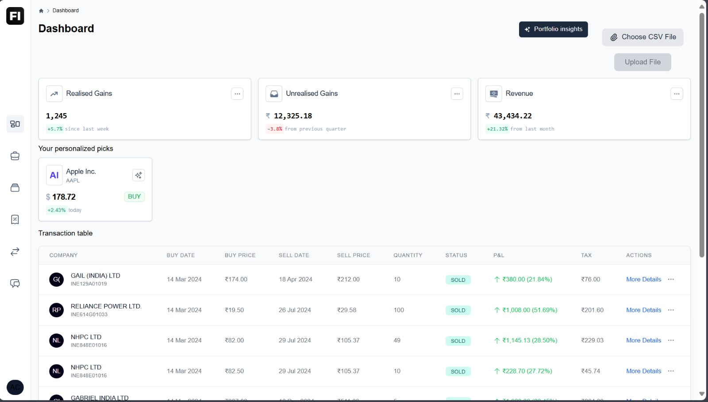
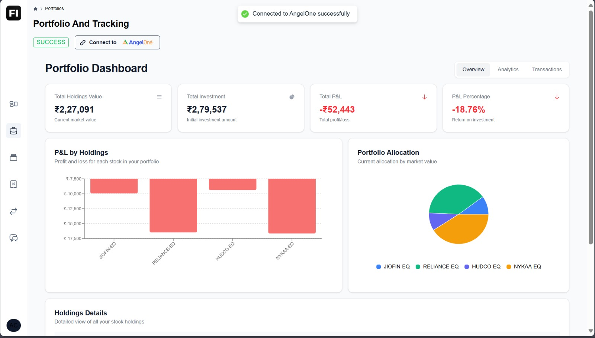
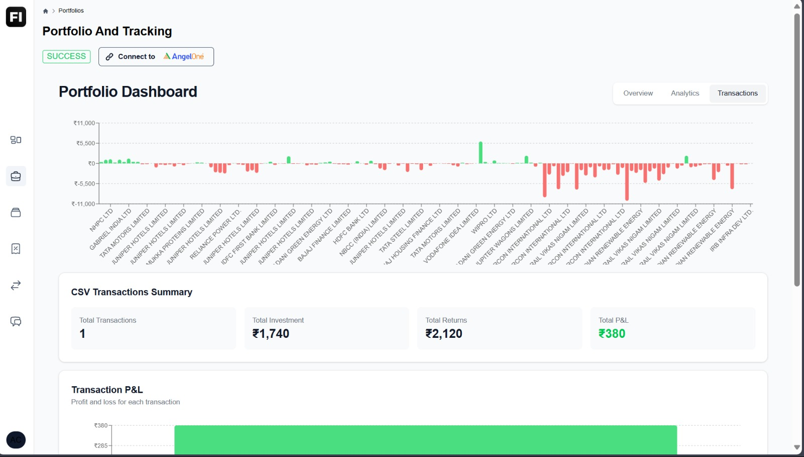
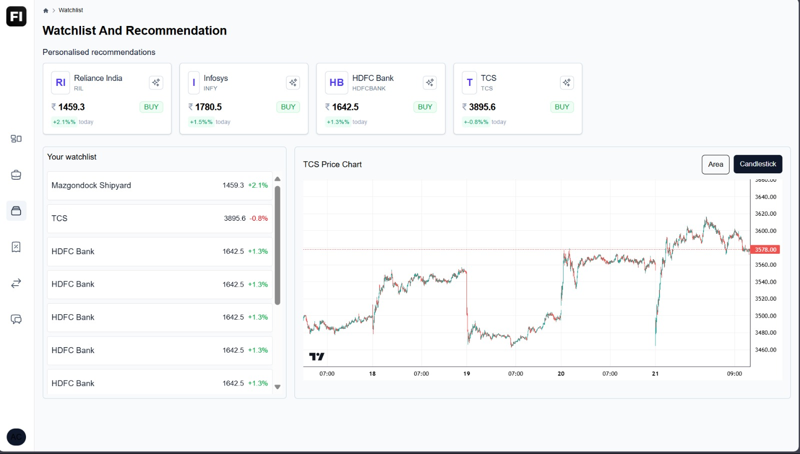
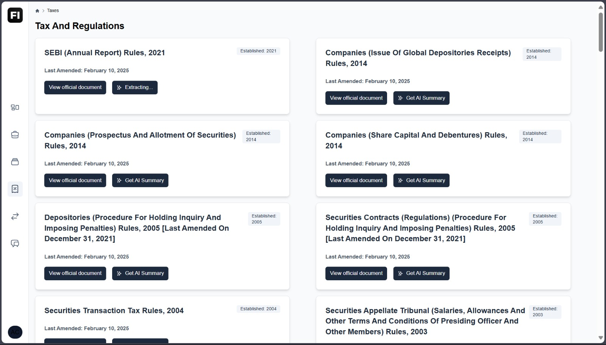
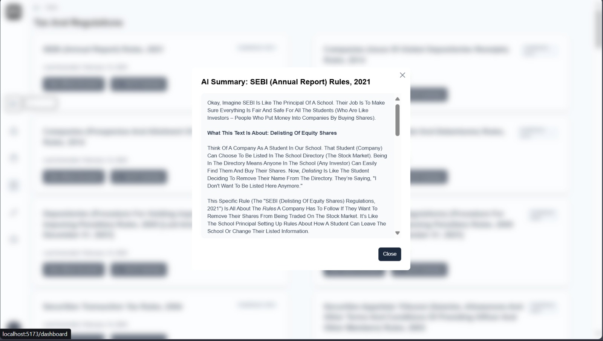
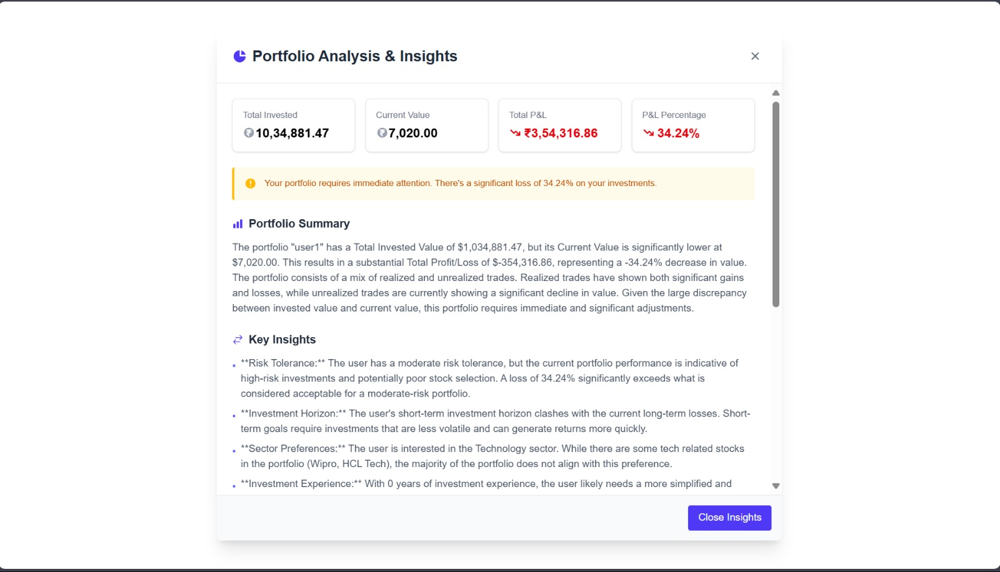
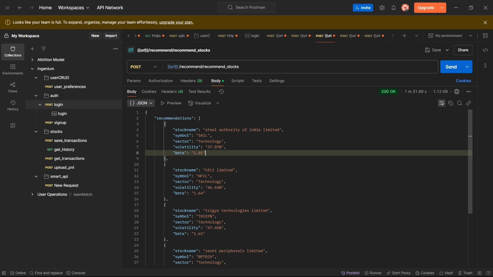

# Finovera

Welcome to the **Finovera**, a financial management platform designed to empower retail investors with AI-driven insights, real-time data, and user-friendly tools. Developed by **Team Bright-Hive**, this project leverages advanced AI capabilities (Gemini LLM) to simplify investment, enhance portfolio management, and promote financial literacy.

## Project Overview

The finovera Dashboard is an intelligent, comprehensive solution for retail investors. It integrates real-time financial data, personalized recommendations, secure portfolio tracking, and simplified regulatory insights into a single platform. Whether you're a beginner or an experienced investor, this dashboard provides the tools you need to make informed decisions and manage your investments effectively.

## Key Features

1. **AI-Based Personalized Financial Insights**
   - Powered by Gemini LLM for tailored investment recommendations.
   - Considers user goals, risk appetite, and market conditions.

2. **Secure User Authentication and Portfolio Management**
   - Secure login and integration with AngelOne brokerage or CSV imports (e.g., from Groww).
   - Tracks realized/unrealized gains, tax obligations, and portfolio performance.

3. **Interactive Visualizations**
   - Intuitive charts and graphs for portfolio performance, market trends, and diversification.
   - Watchlist visualization with stock movement insights.

4. **Simplified SEBI Regulations**
   - Easy-to-understand summaries of SEBI rules (e.g., "SEBI (Annual Report) Rules, 2021").
   - AI-generated explanations for better regulatory awareness.

5. **Real-Time Financial Data**
   - Live stock prices, historical data, and news insights via API integrations.

6. **Chatbot Support**
   - Interactive chatbot to answer investment-related queries.

## Screenshots

Below are descriptions of key dashboard pages based on the presentation slides. (In a real README, these would be replaced with actual image files.)

1. **Dashboard Overview** 
   

2. <b>Portfolio page</b>  
   

3. **Candle stick graph** 
   

4. **Real data plotting** 
   

5. **SEBI rules and regulations** 
   

6. **Simple explaination by AI** 
   

7. **Personalised Insights for user according to onboarding form** 
   

# EXTRA FEATURES
8. **Implementation Of recommendation model** 
   
## Installation
